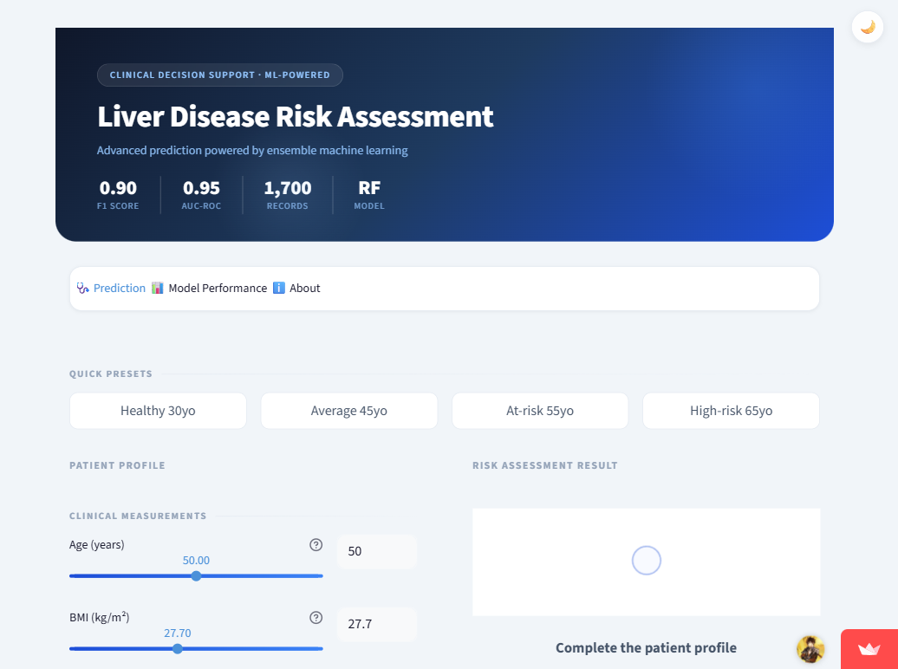
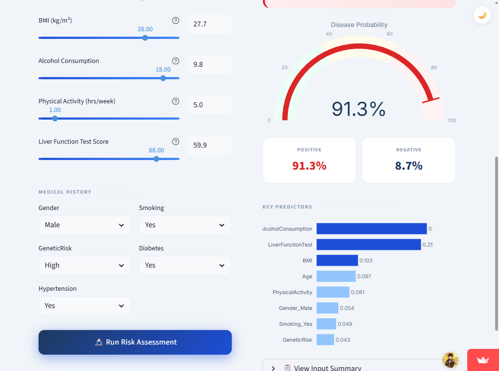
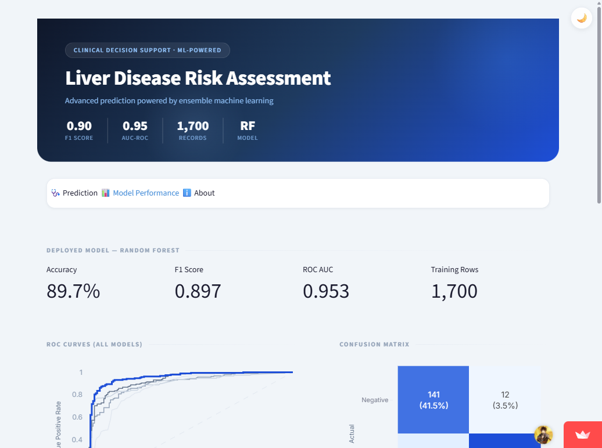
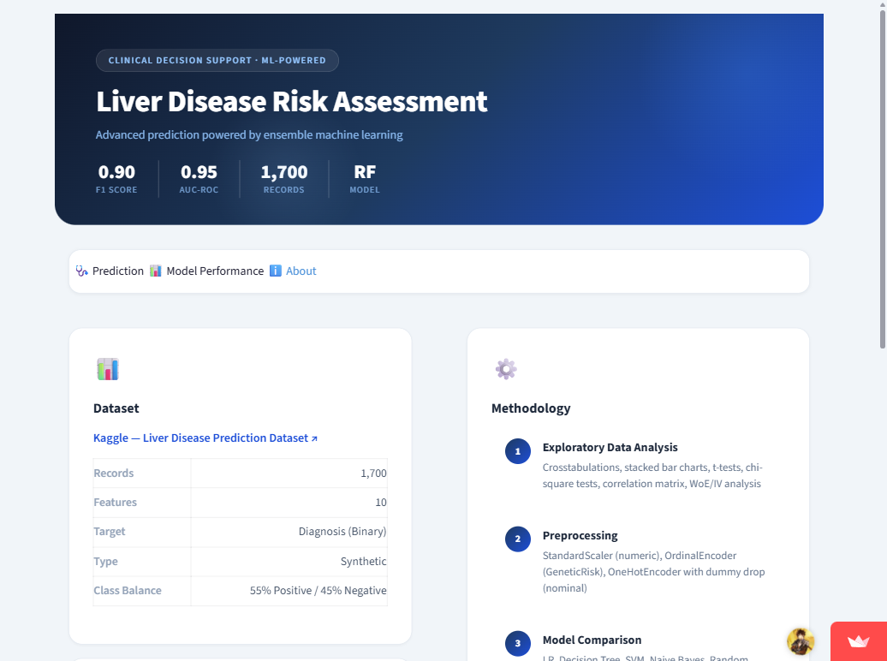

# Clinical Liver Risk Analysis Through Explainable Hybrid Intelligence

[](https://github.com/MelvinJoshua1375/liver-explainable-hybrid-intelligence/actions/workflows/ci.yml)
[](https://liver-disease-project.streamlit.app/)

Binary classification pipeline predicting liver disease from patient clinical and demographic data. Portfolio-quality ML project with proper architecture, TDD, Optuna hyperparameter tuning, WoE/IV analysis, SHAP explanations, and Streamlit deployment with CI/CD.

**Live demo**: https://liver-disease-project.streamlit.app/

## Screenshots

| Prediction Tab | High-Risk Result |
|:-:|:-:|
|  |  |

| Model Performance | About |
|:-:|:-:|
|  |  |

## Results

| Model | F1 (Weighted) | ROC AUC |
|-------|:---:|:---:|
| Logistic Regression | 0.82 | 0.90 |
| Decision Tree (calibrated) | 0.84 | 0.90 |
| SVM | 0.85 | 0.93 |
| Naive Bayes | 0.78 | 0.87 |
| **Random Forest** | **0.90** | **0.95** |
| DT + LR Hybrid | 0.90 | 0.96 |

**Best deployed model**: Random Forest (`max_depth=10, n_estimators=100, min_samples_split=10, min_samples_leaf=4`)

## Setup

```bash
git clone https://github.com/MelvinJoshua1375/liver-explainable-hybrid-intelligence.git
cd liver-explainable-hybrid-intelligence
pip install -e ".[dev]"
python scripts/download_data.py   # or place CSV manually at data/liver_disease_data.csv
```

## Common Commands

```bash
make install         # Install production dependencies
make install-dev     # Install dev dependencies (pytest, ruff, etc.)
make test            # Run pytest (80%+ coverage)
make lint            # Ruff linter
make train           # Train model -> models/liver_disease_model.pkl
make run             # Launch Streamlit app locally (http://localhost:8501)
make clean           # Remove caches
```

## Project Structure

```
src/                              # All reusable logic (single source of truth)
  data/                           # Loader, validation, stratified splitting
  features/                       # Preprocessing, WoE/IV, schema definitions
  models/                         # Model registry, Optuna tuning, DTSegmentedLR hybrid
  evaluation/                     # Metrics, calibration, cross-validation, SHAP explanations
  visualization/                  # EDA plots, style constants
app/                              # Streamlit app (3 tabs)
  components/                     # Prediction, Model Info, About, styles, utils
notebooks/                        # Lean narrative notebooks (import from src/)
scripts/                          # train_model.py, generate_metadata.py
tests/                            # 100+ pytest tests (TDD-first)
models/                           # Trained pipeline + metadata JSON
config/                           # settings.yaml
docs/
  screenshots/                    # App screenshots for README
  Statisical Exploration...pptx   # Original EDA presentation
```

## Key Features

### SHAP Explanations
Every prediction includes a **per-patient SHAP waterfall chart** showing exactly which features pushed the risk up or down. The Model Performance tab shows **global SHAP importances** — how much each feature matters on average across the dataset. This goes beyond standard feature importances (which measure split quality) by providing game-theory-grounded, locally accurate explanations.

### Architecture Highlights
- **Single preprocessor**: `src/features/preprocessing.py:create_preprocessor()` — OrdinalEncoder for `GeneticRisk` (preserves Low < Medium < High ordinal signal), OneHotEncoder with `drop="if_binary"` for nominal binary features.
- **No data leakage**: WoE mappings use `compute_woe_mappings(train)` -> `apply_woe_mappings(test, mappings)`. `DTSegmentedLR` is a proper sklearn `BaseEstimator` that fits only on training folds during cross-validation.
- **Overfitting detection**: Flags when train-test gap > 2x test score std dev across CV folds (replaces the original arbitrary 0.1 threshold).
- **DT+LR Hybrid**: Shallow Decision Tree extracts leaf segments -> OneHotEncoded -> concatenated with features -> Logistic Regression. Based on the Facebook GBDT+LR technique.
- **WoE smoothing fix**: Laplace smoothing applied only when at least one bin has a zero count.

## Dataset

Synthetic dataset from [Kaggle](https://www.kaggle.com/datasets/rabieelkharoua/predict-liver-disease-1700-records-dataset): 1,700 records, 10 features (5 numeric, 5 categorical), binary target (55% Positive / 45% Negative). Raw CSV uses integer codes decoded to string labels by the data loader.

## CI/CD

GitHub Actions on every push: **Lint** -> **Tests** (80% coverage) -> **Notebook validation** -> **Artifact verification** -> Streamlit Cloud auto-deploy.

## Author

Melvin Joshua — 2026
